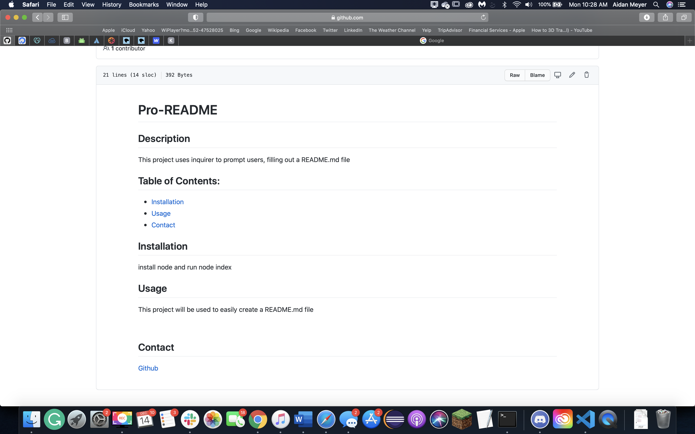

# Pro-README

## Description 
This project uses inquirer to prompt users, filling out a README.md file
## Table of Contents:
* [Installation](#Installation) 
* [Usage](#usage) 
* [Contact](#contact)
    
## Installation
install node and run node index
## Usage
This project will be used to easily create a README.md file

## Contact
[Github](https://github.com/XXLZopes)

