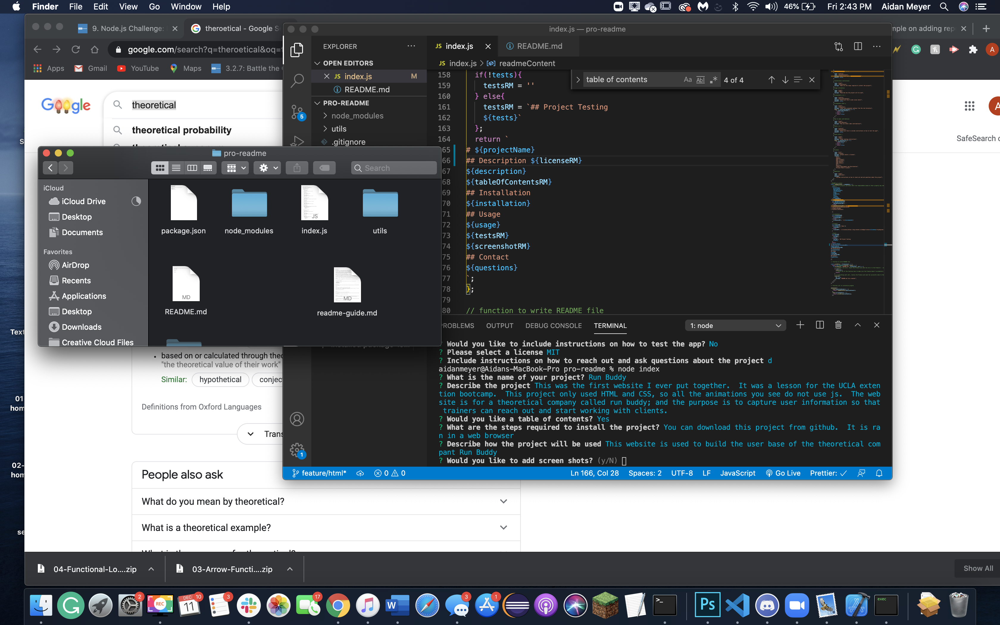

# Run Buddy
## Description 
This was the first website I ever put together.  It was a lesson for the UCLA extention bootcamp.  This project only used HTML and CSS, so all the animations you see do not use js.  The website is for a theoretical company called run buddy; and the purpose is to capture user information so that trainers can reach out and start working with clients.  
## Table of Contents:
* [Installation](#Installation) 
* [Usage](#usage) 
* [Contact](#contact)
    
## Installation
You can download this project from github.  It is ran in a web browser
## Usage
This website is used to build the user base of the theoretical compant Run Buddy

## Contact
Contact me vie email at: afordm99@gmail.com
